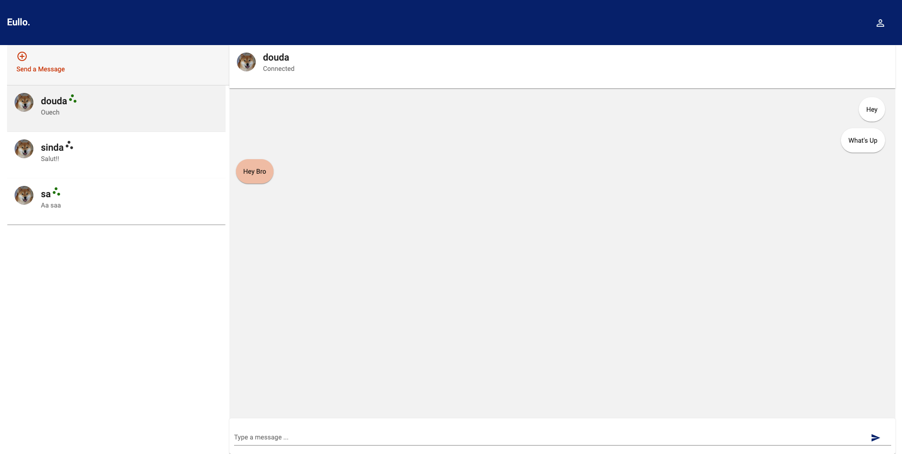

# Eullo

Eullo is a secure chat web application that provides end-to-end encryption using asymmetric encryption and RSA key pairs. This project utilizes various technologies such as Flask, LDAP, Angular, AWS, Terraform, and Socket.io. It aims to provide a secure and private communication platform for users.



## Project Structure

The project is organized into the following components:

### 1. Eullo-Back

The `Eullo-Back` directory contains the backend logic of the application. It is built using Flask, a Python web framework. The backend handles user authentication, message encryption and decryption, and communication with the frontend.

### 2. Eullo-Front

The `Eullo-Front` directory contains the frontend logic of the application implemented using Angular, a popular JavaScript framework. The frontend provides a user-friendly interface for interacting with the chat application, displaying messages, managing contacts, and handling encryption and decryption.

### 3. Infrastructure

The `Infrastructure` directory contains the Terraform configuration files required to deploy the application on AWS EC2 instances. Terraform is an infrastructure as code tool that enables automated provisioning and management of cloud resources. It ensures the infrastructure is created and maintained consistently.

## Installation and Deployment

To deploy the Eullo application, follow these steps:

1. Clone the project repository:

git clone https://github.com/your-username/eullo.git


2. Set up the backend:

    - Navigate to the `Eullo-Back` directory:
      ```
      cd Eullo-Back
      ```

    - Install the required dependencies:
      ```
      pip install -r requirements.txt
      ```

    - Configure the LDAP settings in the `config.py` file.

    - Run the backend server:
      ```
      python app.py
      ```

3. Set up the frontend:

    - Navigate to the `Eullo-Front` directory:
      ```
      cd Eullo-Front
      ```

    - Install the required dependencies:
      ```
      npm install
      ```

    - Configure the backend API URL in the `src/environments/environment.prod.ts` file.

    - Build the frontend application:
      ```
      ng build --prod
      ```

    - Serve the application using a web server of your choice.

4. Deploy the infrastructure:

    - Navigate to the `Infrastructure` directory:
      ```
      cd Infrastructure
      ```

    - Configure your AWS credentials and other settings in the Terraform configuration files.

    - Initialize Terraform:
      ```
      terraform init
      ```

    - Deploy the infrastructure:
      ```
      terraform apply
      ```

    - Once the deployment is complete, you will receive the URL for accessing the Eullo application.

## Usage

1. Open the Eullo application in a web browser.

2. Create an account or log in with your existing credentials.

3. Start a conversation with another user by adding them to your contacts.

4. Exchange encrypted messages securely with your contacts.

## Contributing

Contributions to Eullo are welcome! If you find any bugs, have feature requests, or would like to contribute in any way, please open an issue or submit a pull request in the project repository.

## License

This project is licensed under the [MIT License](LICENSE).

## Contact

If you have any questions or inquiries regarding Eullo, feel free to contact us at [email protected]

We hope you enjoy using Eullo and find it useful for secure and private communication!
